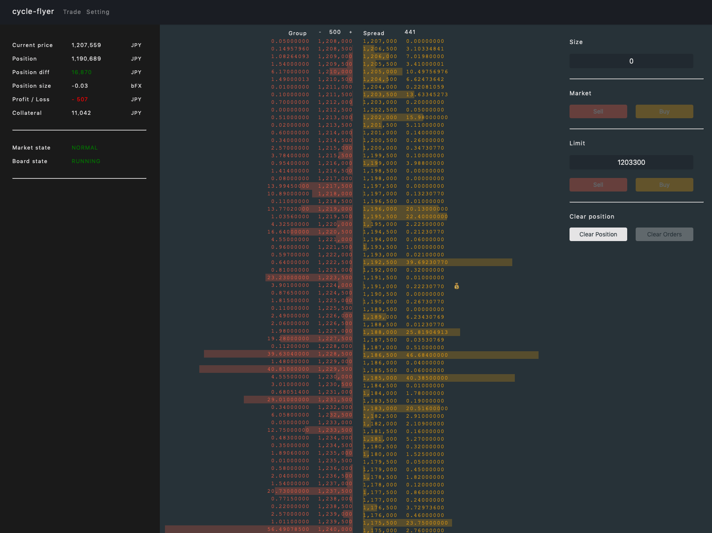

# cycle-flyer

https://cycle-flyer.now.sh/

### Warning
To use this application, you must disable cors option by [StackOverflow](https://stackoverflow.com/questions/3102819/disable-same-origin-policy-in-chrome) because bitFlyer API is not support CORS. 
